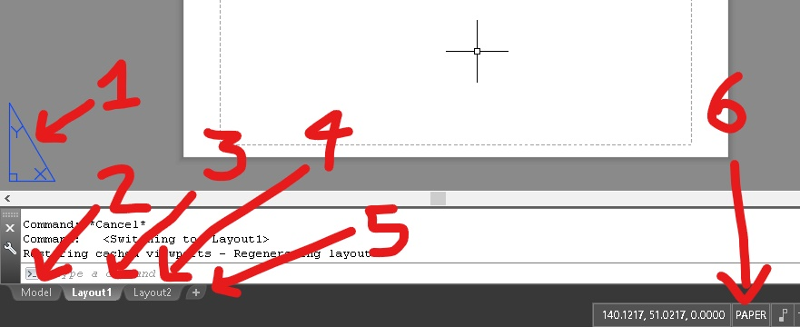
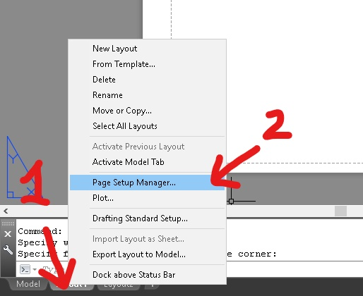
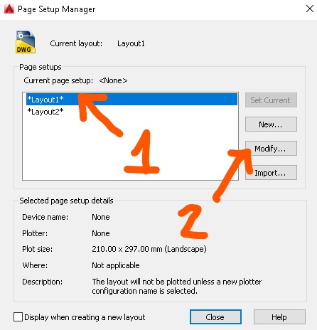
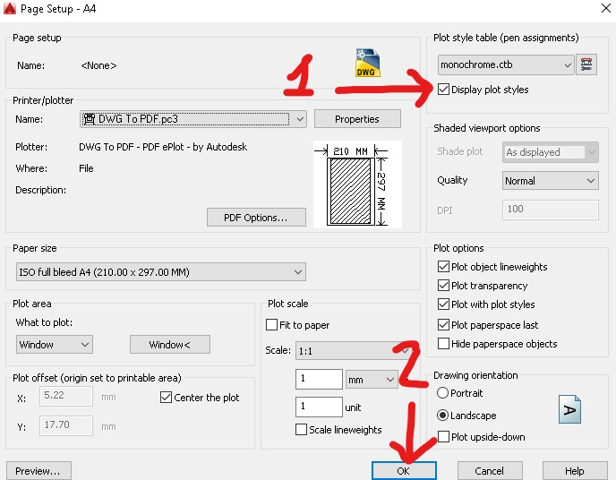

# Guia de Trabalho no Paper Space(Layout) - Autocad

O **Paper Space** é a maneira mais organizada e clara de se preparar uma planta para a plotagem. O desenho dos projetos é sempre feito no **Model Space** mas, nesta forma de trabalhar, o desenho do formato, do carimbo e, em alguns casos, outras informações de prancha, são desenhados no **Paper Space**.

## Alternando Entre o Model Space e o Paper Space

A figura abaixo mostra um trecho da interface do Autocad no **Model Space**. O ícone do **UCS**(1)(*User Coordinates System*) indica os eixos x e y do espaço de desenho. As Abas abaixo da linha de comando permitem mudar o espaço de trabalho entre o **Model Space**(2) e o **Paper Space**(3). Para cada Arquivo .DWG existe apenas um **Model Space** mas podem existir diversos **Layouts**. Os **Layouts** são páginas do **Paper Space** que podem ser configuradas para plantas diferentes de um mesmo projeto. Os termos **Paper Space** e **Layout** são comumente usados para se referir ao mesmo conjunto de ferramenta.

É possível mudar do **Model Space** para o **Paper Space** de algumas maneiras:

* Clicando em uma das abas **Layout**(3).
* Clicando no botão **+**(4), para criar uma nova aba de **Layout**.
* Com um duplo clique no botão **Model**(5).

O cliquie em uma das abas **Layout** leva ao **Paper Space** desenhado e configurado na aba clicada. O duplo clique no botão **Model**(5) leva ao **Layout** mais recentemente acessado. O botão **+** cria uma nova aba **Layout**.

A figura abaixo mostra um trecho da interface do Autocad no **Paper Space**. O ícone do **UCS**(1) no **PaperSpace** assemelha-se a um esquadro. Juntamente com o botão **PAPER**(6), o ícone do **UCS** é um dos indicadores de que estamos trabalhando no **Paper Space**. O **Layot** que está sendo editado aparece com o nome realçado na aba(2) e os demais com o nome em cinza(4). Também é possível adicionar um novo **Layout** no botão **+**(5).

É possível mudar do **Paper Space** para o **Model Space**:

* Clicando na aba **Model**(2).
* Digitando o comando **Model** na linha de comandos.

## Desenhando no Paper Space(Layout)

No **Paper Space** as operações de desenho são executadas da mesma forma que no **Model Space**. Os comandos de desenho, edição e ajuste de camadas são os mesmos.

Para desenhar as margens do formato A4:

1. Digite o comando **rectangle(rec)** na linha de comando, ou chame o comando pelo ícone.
1. Clique em um ponto qualquer no **Paper Space**.
1. Digite na linha de comando, as medidas da margem externa **em milímetros**: **@210,297**.
1. Use o comando **offset(o)** com distância de 7mm para desenhar a margem interna.
1. redimensione a margem esquerda para 25mm usando o comando **stretch(s)** ou os **grips**.
1. coloque as margens interna e externa em layers próprios, com cores correspondentes á espessura de linha de cada margem.

## Trabalhando com Viewports

Os elementos desenhados no **Model Space** são transpostos para o **Layout** através das **Viewports**. O comando **mview(mv)** é responsável pela criação das **Viewports**. Digitando o atalho **mv** na linha de comando, pode-se clicar em dois vértices opostos e definir a os limites de uma **viewport** retangular.

A **viewport** é uma janela para o **Model Space** dentro do **Paper Space**. Selecionando uma **viewport** é possível ajustar uma escala nos controles de escala anotativa na parte inferior da tela.

## Configurando a Plotagem no Paper Space(Layout)

As configurações de plotagem no **Paper Space** são basicamente as mesmas do [**Model Space**](.\plot\plotModel.md). Na configuração proposta por este guia, apenas a escala de plotagem, quadro **Plot scale**, deve ser ajutada para **1 mm** x **1 unit**.

## Exibindo as configurações do **CTB** no Paper Space(Layout)

Para exibir as cores configuradas para plotagem no CTB (ao invés das cores dos layers) deves-se seguir os seguintes passos:

* Abra a caixa de diálogo **Page Setup Manager** clicando com o botão direito em uma aba de layout e em seguida clicando na opção **Page Setup Manager** ou digitando **PAGESETUP** na linha de comando.

* Na caixa de diálogo **Page Setup Manager** selecione o Layout que deseja ativar a exibição de configurações do CTB e clique no botão **Modify**.

* A caixa de Diálogo **Page Setup** do **Layout** selecionado é aberta. Nesta caixa pode-se Configurar a plotagem da mesma forma que se faz na caixa de diálogo **Plot**(Ctrl + P), embora não exista a opção de plotar. A opção **Display Plot Styles**, entretanto é exibida apenas nesta caixa. clique na opção **Display Plot Styles** e em seguida clique no botão **OK** para salvar a alteração.

As operações descritas acima devem ser executadas para cada **Layout**. As demais configurações de plotagem podem ser configuradas tanto na caixa de diálogo  **Page Setup** do **Layout** selecionado quanto na caixa de diálogo **Plot**(Ctrl + P).

## Ativando a Exibição de Espessura de Linha

A exibição das espessuras de linhas podem ser ativadas e desativadas pela variável do sistema **LWDISPLAY** ou pelo botão de mesmo nome na parte inferior da tela.

Quando o botão está azul as espessuras de linha estão ativadas, quando branco a exibição está desativada.

Digitando **LWDISPLAY** na linha de comando pode-se ativar a exibição digitando em seguida **ON** 0u **1**, e desativar digitando **OFF** ou **0**.
