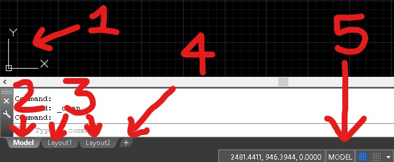

# Guia de Trabalho no Paper Space(Layout) - Autocad.

O **Paper Space** é a maneira mais organizada e clara de se preparar uma planta para a plotagem. O desenho dos projetos é sempre feito no **Model Space** mas, nesta forma de trabalhar, o desenho do formato, do carimbo e, em alguns casos, outras informações de prancha, são desenhados no **Paper Space**.

A figura abaixo mostra um trecho da interface do Autocad no **Model Space**. O ícone do **UCS**(1)( *User Coordinates System*) indica os eixos x e y do espaço de desenho. A Abas abaixo da linha de comando permitem mudar o espaço de trabalho entre o **Model Space**(2) e o **Paper Space**(3). Para cada Arquivo .DWG existe apenas um **Model Space** mas podem existir diversos **Layouts**. Os **Layouts** são páginas do **Paper Space** que podem ser configuradas para plantas diferentes de um mesmo projeto. Os termos **Paper Space** e **Layout** são comumente usados para se referir ao mesmo conjunto de ferramenta.

É possível mudar do **Model Space** para o **Paper Space** de algumas maneiras:

* Clicando em uma das abas **Layout**(3).
* Digitando o comando **paperspace(ps)**.
* Clicando no botão **+**(4), para criar uma nova aba de **Layout**.
* Com um duplo clique no botão **Model**(5).

## Caixa de diálogo de plotagem
