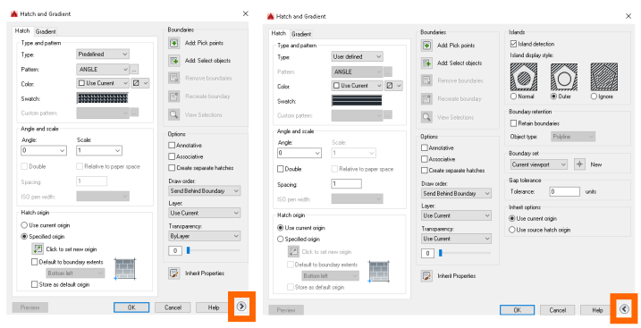
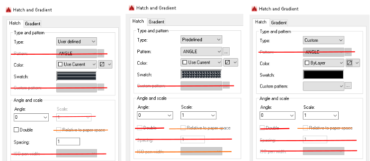
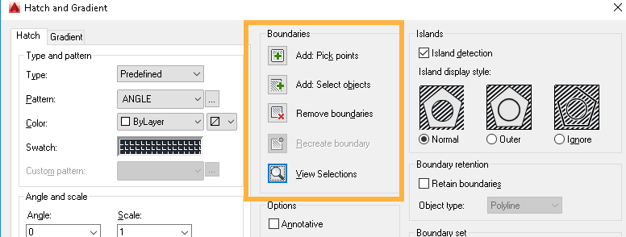
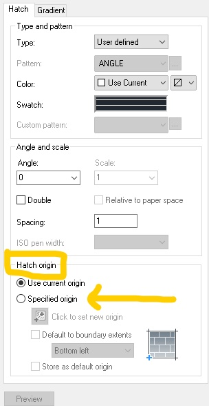
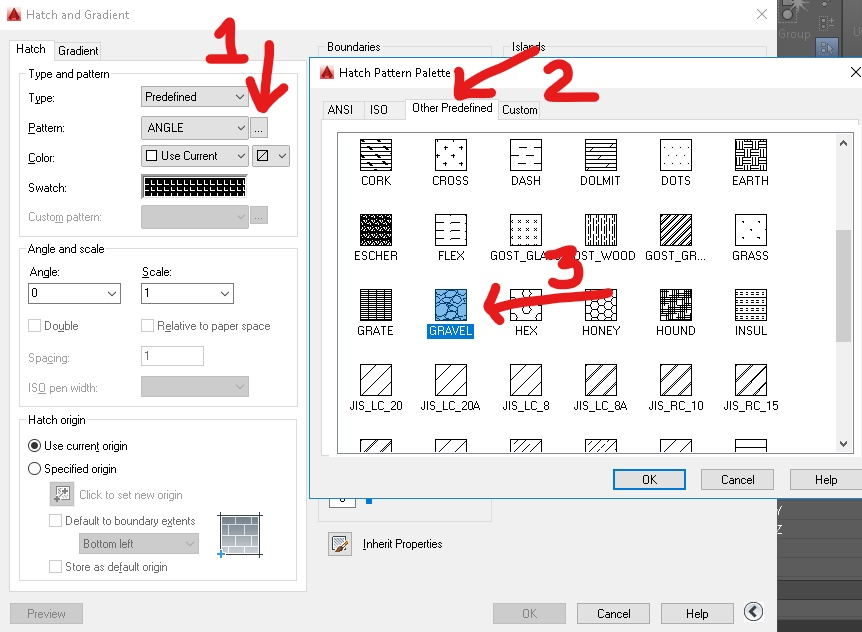

## Guia de Hachuras Autocad

O comando de criação de hachuras pode ser acionado pela linha de comando hatch(h) ou pelo ícone da figura abaixo:

O comando aciona uma caixa de diálogo ou um menu especial do Ribbon.

a variável do sistema HPDLGMODE controla a exibição da caixa de diálogo. Para acompanhar esse guia, ajuste a variável para 1.

Na caixa de diálogo existe um botão em forma de seta. Ele mostra configurações ocultas na caixa de diálogo.

Os tipos e padrões de hachura são acessados no quadro superior esquerdo da caixa de diálogo. Na figura a baixo podemos ver que a seleção do tipo de hachura habilita e desabilita opções dos quadros **type and pattern** e **angle and scale**

### Hachura Sólida (solid)

- Selecione o tipo **predefines** e o padrão **solid**
- para este tipo de hachura não é necessário utilizar o quardro **angle and scale**
- No quadro **Boundaries** é possível selecionar objetos para serem hachurados:

- a opção **Add pick points** retorna para a tela do Autocad e permite que as áreas sejam selecionadas clicando nos pontos internos de conjuntos fechados de entidades de Desenho.

- a opção **Add select object** permite a seleção de entidades fechadas (círculos, polilinhas ou splines fechadas e regiões)

- No quandro **options** é possível selecionar o layer para colocar a hachura.

- também é possível determinar se áreas diferentes serão hachuradas com um mesmo objeto ou com hachuras distintas na opção **Create separate hatchs**.

- A opção **Associative** determina se as hachuras devem ser atualizadas quando as bordas forem editadas.

### User Defined

Quando se pretende usar as hachuras para representar paginações de piso ou revestimento, Costuma utilizar o **Type** **user defined**.

Usando este tipo é possível especificar uma distância fixa entre as linhas, no campo **spacing** do quadro **Angle and scale**.

No mesmo quadro é possível definir o ângulo das linhas no campo **angle**. O campo scale fica desabilitado para tipo **user defined**.

O campo **Double** pode ser usado para retículas de linhas ortogonais quadradas. Para retículas retangulares usa-se a sobreposição de duas hachuras.

No quadro **hatch origin** é possível selecionar o início de uma hachura na opção **specified origin**

### Predefined hatch

Os tipo de hachura predefinidos possibilitam a utilização de padrões de preenchimento previamente definidos. A Hachura sólida é o padrão  mais simples, mas outros padrões podem ser escolhidos no seletor **Pattern** do quadro **Type and Pattern**.

clicando no botão ao lado do seletor **Pattern** selecione a aba **Other predefined** e escolha o padrão **Gravel**

No quadro **Angle and scale** é possível determinar o ângulo e a escala das hachuras, mas não é possível determinar distâncias, como no tipo **user defined**

Para ajustar a escala certa para cada padrão do tipo **Predefined**, muitas vezes é necessário experimentar com os valores.
